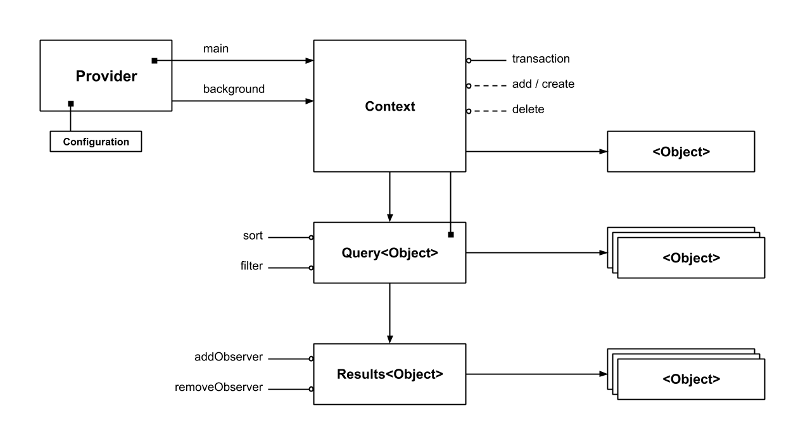

# FlooidRealm
FlooidRealm is a simple wrapper around the Realm framework, designed to give you the same syntax as [FlooidCoreData](https://github.com/martin-lalev/FlooidCoreData) (wrapper around the CoreData framework) where the only difference are the class name prefixes (`Realm-` vs `CoreData-`).
> Of course, you will need to provide different model implementations (`NSManagedObject`s for CoreData and `Object`s for Realm) which may lead to slight differences in how you get or set their properties.



## Installation

#### CocoaPods
`pod 'FlooidRealm', :git => 'https://github.com/martin-lalev/FlooidRealm', :tag => '0.0.12'`

## Setup

1. Create a `RealmProvider`: this object stores the `Realm.Configuration` as well as a refence to a main thread `Realm` object. It can also provide you with a background `Realm` object via a closure
```swift
let realmProvider = RealmProvider(inMemory: false)
...

let mainContext = realmProvider.mainContext
// do stuff on the main thread via mainContext
...

realmProvider.performInBackground(action: { backgroundContext, done in
  // do stuff in background via backgroundContext and once ready call done()
  done()
}, then: {
  // do stuff back on the main thread
})
```

3. Conform your Realm entity classes to `DataObjectProtocol`
```swift
extension UserRealmObject: DataObjectProtocol {
    public static func idKey() -> String { return "id" }
    ...
}
```

## Usage
When you use `RealmProvider`'s `mainContext` (or the background one via `performInBackground`) what you actually get is an object of type `RealmContext`, which wraps a `Realm` object.
Using this object you can perform transactions, execute queries, get live results, or find or create entities.

```swift
let context: RealmContext
...

// Transactions
context.transaction { transactionContext

  // Find or create
  let user = UserRealmObject.findOrCreate(forID: "123", in: transactionContext)
  
  // Delete
  transactionContext.delete(user)
  
  // Find One (and update)
  let user2 = UserRealmObject.object(forID: "111", in: transactionContext)
  user2?.name = "Jon Anec"
}
// After the block is completed, the `context` object takes care of merging the changes you've made.
...

// Querying
let adminUsersQuery = UserRealmObject.query(in: context)
    .filter(NSPredicate("role = %@", "admin"))
    .filter(NSPredicate("deleted = %d", false)) // Chaining filters will result in "NSCompoundPredicate(andPredicateWithSubpredicates:)" on them
    .sort(NSSortDescriptor(key: "name", ascending: true))

let adminUsers = adminUsersQuery.execute()

// Get an automatically updatable (and observable) results object
let adminUsersResults = adminUsersQuery.results()
let usersFromResult = adminUsersResults.objects
...

adminUsersResults.addObserver(self, #selector(usersChanged), .updated)

```
